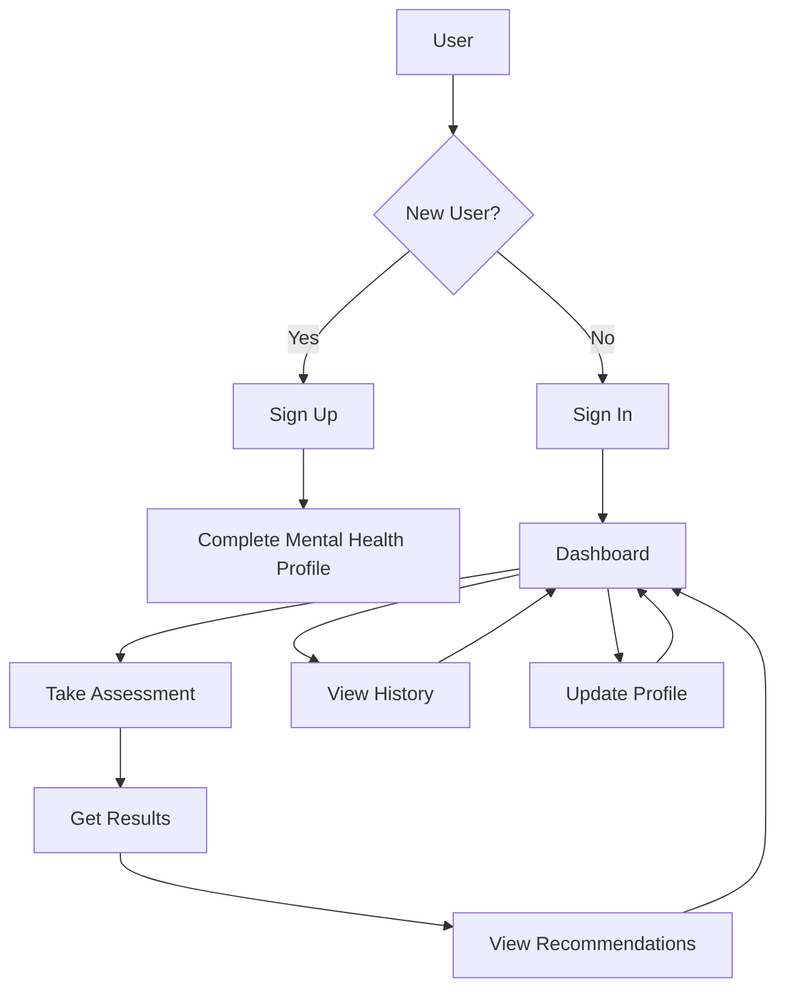

# 🌟 Mind Mate: Mental Health Companion 🧠

👋 Welcome to Mind Mate! We're thrilled to have you here. This project aims to make mental health tracking and assessment more accessible and user-friendly for everyone.

## 🎯 Vision

Mind Mate is designed to be your personal mental health companion, helping you understand and track your mental well-being through scientifically validated assessments and intuitive tracking tools.

## ✨ Features

- 📊 Comprehensive Mental Health Assessments
  - ADHD Test (20 questions)
  - Anxiety Assessment (20 questions)
  - Depression Screening (20 questions)
  - PTSD Evaluation (20 questions)
  - Eating Disorder Assessment (20 questions)
  - OCD Screening (20 questions)
  - Bipolar Disorder Assessment (20 questions)
  
- 👤 Personalized User Experience
  - Secure authentication
  - Detailed profile management
  - Test history tracking
  - Progress visualization

- 📱 Modern & Accessible Design
  - Responsive UI for all devices
  - Intuitive navigation
  - Real-time feedback
  - Dark mode support

## 🔄 Application Flow



## 🛠️ Tech Stack

### Frontend
- ⚛️ React.js
- 🎨 Tailwind CSS
- 🔄 Axios
- 🛣️ React Router

### Backend
- 🚀 Flask (Python)
- 🗄️ SQLite Database
- 🔒 JWT Authentication
- 📊 SQLAlchemy ORM

## 🚀 Getting Started

### Prerequisites
- Python 3.8+
- Node.js v14+
- npm or yarn

### Installation

1. 📥 Clone the repository:
```bash
git clone https://github.com/yourusername/mind-mate.git
cd mind-mate
```

2. 🔧 Set up the backend:
```bash
cd backend
python -m venv venv
source venv/bin/activate  # On Windows: venv\Scripts\activate
pip install -r requirements.txt
flask run
```

3. 🎨 Set up the frontend:
```bash
cd frontend
npm install
npm start
```

The application will be available at `http://localhost:3000` 🌐

## 🔗 API Endpoints

### Authentication
- 🔐 POST `/api/auth/signup` - Register new user
- 🔑 POST `/api/auth/signin` - User login
- 👤 GET `/api/auth/profile` - Get user profile
- ✏️ PUT `/api/auth/profile` - Update user profile

### Tests
- 📝 GET `/api/tests/:type/questions` - Get test questions
- ✅ POST `/api/tests/:type/submit` - Submit test answers
- 📊 GET `/api/tests/history` - Get user's test history

## 🤝 Contributing

We welcome contributions! Here's how you can help:

1. 🍴 Fork the repository
2. 🌿 Create your feature branch (`git checkout -b feature/AmazingFeature`)
3. 💾 Commit your changes (`git commit -m 'Add some AmazingFeature'`)
4. 📤 Push to the branch (`git push origin feature/AmazingFeature`)
5. 🎉 Open a Pull Request

## 📄 License

This project is licensed under the MIT License - see the LICENSE file for details

## 💖 Support

If you find this project helpful, please consider giving it a ⭐️. Your support means a lot to us!
